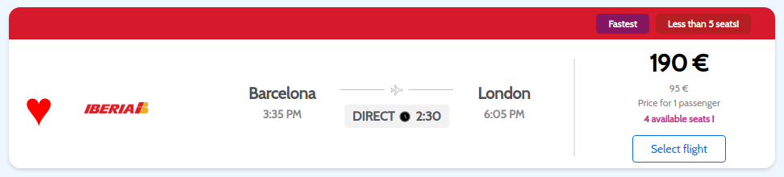
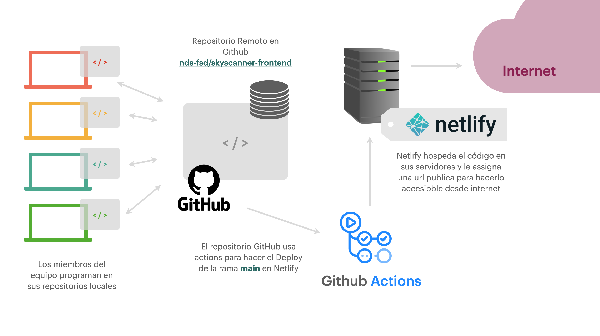

# Skyscanner - Frontend

Skyscanner es un proyecto llevado a cabo por un equipo de desarrolladores del máster en Full Stack Developement de la escuela Nuclio Digital School. El objeto del proyecto es un aplicativo web full stack orientado a la búsqueda y gestión de vuelos nacionales. Entre otras funcionalidades, la aplicación ofrece al usuario funciones como la aplicación de filtros sobre los resultados, la creación y gestión de sesiones de usuario y la posibilidad de guardar y reservar vuelos, entre otras.


## Acceso web

El aplicativo web está alojado en los servidores ofrecidos por Netlify y la URL asignada es https://sky-reader.netlify.app/. Si quisiera ser usada de manera local, los pasos a seguir para su instalación son los descritos a continuación.
### Instalación en local
En primer lugar debemos clonar el repositorio a nuestra máquina local usando:
```bash
git clone git@github.com:goby-lang/sample-web-app.git
```
*Se debe tener en cuenta que al tratarse de un repositorio privado, se requieren ciertos permisos para acceder al código.*

Una vez clonado el código, debemos instalar todas las dependencias con el comando:
```bash
npm install
```
Una vez hecho instalados todos los paquetes ya se puede levantar la aplicación mediante: 
```bash
npm start
```
Una vez hecho todo esto ya tendremos nuestra aplicación corriendo en https://localhost:3000.
## Descripción técnica
El aplicativo de se ha desarrollado con **React**.


</br>

## Librerías
Las librerías usadas en la aplicación son:

| Liberia | Utilidad |
| ----------- | ----------- |
| React-Hook-Form | Gestión de los formularios |
| React-Router-Dom | Navegabilidad mediante rutas url |
| JWT Decode | Decodificación del token de usuario |
| Moment | Gestión de objetos Timestamp |
| React-Scripts | Creación de scripts |
| SweetAlert2 | Alertas de interacción con Backend |

Todas ellas han sido instaladas y gestionadas mediante el gestor de paquetes **npm**.

## Piezas de código destacables

Una de los componentes más trabajados de la aplicación són las cards de vuelos que se muestran en distintas rutas de la app. 

```JSX
<div className="card">
   <div className={`${airline?.replace(/\s/g, '').toLowerCase()} card-color `} />
   <div className="card-content">
      <div className="fav-flight" style={styleFav} onClick={() => addToFavFlight(flight._id)}>♥</div>
      <div className="logo-container">
         {airline?.replace(/\s/g, '').toLowerCase() === "vueling" && }
         {airline?.replace(/\s/g, '').toLowerCase() === "ryanair" && }
         {airline?.replace(/\s/g, '').toLowerCase() === "iberia" && }
         {airline?.replace(/\s/g, '').toLowerCase() === "aireuropa" && }
         {airline?.replace(/\s/g, '').toLowerCase() === "bintercanarias" && }
      </div>
      <div className="flight-info">
         <div className="from-to">
            <p className="city-name">{from}</p>
            <span className="de-arr-time">{moment(dedate).format('LT')}</span>
         </div>
         <div className="trip">
            
            <div className="duration">
                  <span>DIRECT</span>
                  <svg xmlns="http://www.w3.org/2000/svg" className="clock-icon" fill="E5E5E5" width="10px" height="10px" viewBox="0 0 24 24" stroke="currentColor">
                     <path stroke-linecap="round" stroke-linejoin="round" stroke-width="2" d="M12 8v4l3 3m6-3a9 9 0 11-18 0 9 9 0 0118 0z" />
                  </svg>
                  <span>{minutsToHHMM(flighttime)}</span>
            </div>
         </div>
         <div className="from-to">
            <p className="city-name">{to}</p>
            <span className="de-arr-time">{(moment(Date.parse(dedate)+(flighttime*60000)).format('LT'))}</span>
         </div>
      </div>
      <div className="divider"></div>
      <div className="actions">
         <p className="price">{searchParams.passangers * price} €</p>
         {searchParams.passangers !== "1" && <p className="price-unitary">{price} €</p>}
         <span className="price-info">Price for 1 passenger</span>
         {flight.seats < 5 && <span className="seats-info">{flight.seats === 1 ? "Only 1 seat left available!" : flight.seats + " available seats !"}</span>}
         {!returnFlight ? <div>
            {outboundFlight && flight._id === outboundFlight._id ? 
            <button className="book-btn" onClick={handleBookingClick}>
                  🔒 Book flight
            </button> : 
            <button className="buttonSelect" onClick={handleClick}>
                     Select flight
            </button>}
         </div> : <div></div> }
      </div>
   </div>
</div>
```

El componente renderizado se muestra de la siguiente manera:



El componente muestra las características principales del vuelo asi como el precio unitario, precio total en función de los pasajeros seleccionados y alertas que se muestran cuando quedan menos de 5 plazas. También dispone de botones que abilitan funcionalidades como guardar el vuelo como favorito o seleccionarlo para passar a la siguiente página. Por último, otro feature destacable es que el componente padre detecta y etiqueta los vuelos de características especiales como por ejemplo el más corto.

## Deploy
El dolpoy se ejecuta tal y como muestra la siguiente ilustración:


## Mapa estructural del código

```
├─ .gitignore
├─ .idea
├─ README.md
├─ build
├─ node_modules
├─ package.json
├─ public
└─ src
   ├─ App.css
   ├─ App.js
   ├─ App.test.js
   ├─ api
   ├─ components
   │  ├─ avatar
   │  ├─ filters
   │  ├─ flightCard
   │  ├─ flightsTable
   │  ├─ footer
   │  ├─ icons
   │  ├─ loginForm
   │  ├─ modal
   │  ├─ navbar
   │  ├─ profileData
   │  │  ├─ accountData
   │  │  ├─ bookingResult
   │  │  └─ favoriteResult
   │  ├─ profileSidebar
   │  ├─ registerForm
   │  ├─ results
   │  ├─ searchForm
   │  ├─ searchHeader
   │  ├─ selectedCard
   │  ├─ sideBar
   │  └─ topBar
   ├─ context
   │  └─ userContext.js
   ├─ data
   ├─ files
   ├─ images
   ├─ index.css
   ├─ index.js
   ├─ pages
   │  ├─ bookingPage
   │  ├─ home
   │  ├─ layout
   │  ├─ loginPage
   │  ├─ profile
   │  ├─ registerPage
   │  ├─ resultsPage
   │  ├─ returnFlightPage
   │  └─ successPage
   ├─ reportWebVitals.js
   └─ setupTests.js
```
## Contribuyentes
El equipo que ha llevado a cabo el proyecto está formado por:
- Eric Capella ([Github Account](https://github.com/ericcapella))
- Carolina Marianela Gallegos ([Github Account](https://github.com/CarolinaMarianela))
- Jose Luis Conejero ([Github Account](https://github.com/jlcrayo))
- Marc Cuesta Martínez ([Github Account](https://github.com/marccuesta99))